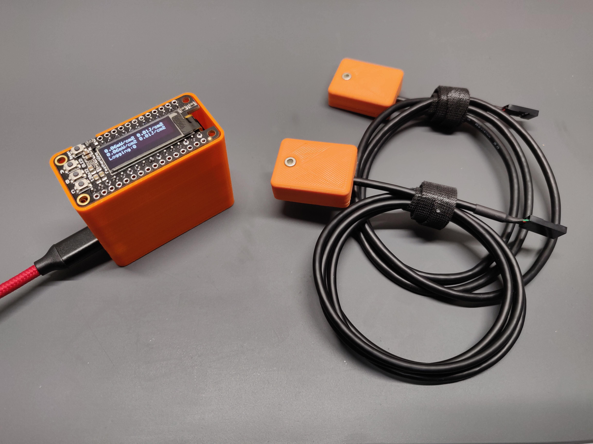

# UV-C Light Meter
Low Cost UV-C Light Meter with Dual Sensor Input and Data Logging

## Background
UV-C based devices are being widely developed on comercial and hobby levels in response to COVID-19. As a result,
there is a shortage of testing equipment including UV-C meters. Hence I developed this low cost solution that can 
be used to measure UV-C intesity. 

## Features
The meter features a small and compact form factor with an oled display. It has a built in RTC and SD card to log
time stamped measurements. It can be used with upto two sensors and further sensors can be added with some modification. 

## Bill of Materials
**Note:** I used the Adafruit Feather ecosystem of development boards for this project for their ease of use and quick assembly. But this meter can
be made using a wide variety of parts so feel free to go for a cheaper option. 
| Part Name | Manufacturer Part Number | Description | Digikey Link |
| ----------- | ----------- | ----------- | ----------- |
| Genicom UV-C Sensor | GUVC-T10GM-LA | This is the sensor used to measure UV-C intesity. It comes precalibrated on a small PCB with an opamp to give a linear analog output.| [GUVC-T10GM-LA](https://www.digikey.com/product-detail/en/genicom-co-ltd/GUVC-T10GM-LA/2096-GUVC-T10GM-LA-ND/10474940) |
| Adafruit Feather M4 Express | 3857 | I used the Feather M4 for its 10bit ADC but you can use any Feather you want. | [Adafruit Feather M4 Express](https://www.digikey.com/product-detail/en/adafruit-industries-llc/3857/1528-2648-ND/9553567)|
| Adalogger Featherwing - RTC + SD | 2922 | The featherwing that adds RTC and SD card functionality. | [Adalogger Featherwing - RTC + SD](https://www.digikey.com/product-detail/en/adafruit-industries-llc/2922/1528-1621-ND/5885911) |
| Featherwing OLED Display | 2900 | The featherwing that displays the current readout and allows for control through buttons. | [Featherwing OLED Display](https://www.digikey.com/product-detail/en/adafruit-industries-llc/2900/1528-1547-ND/5810890) |
| Featherwing Proto | 2884 | Featherwing used to construct the simple circuit | [Featherwing Proto](https://www.digikey.com/product-detail/en/adafruit-industries-llc/2884/1528-1622-ND/5777193) |
| Featherwing Stacking Headers | 2830 | Used to stack all featherwings | [Featherwing Stacking Headers](https://www.digikey.com/product-detail/en/adafruit-industries-llc/2830/2830-ND/5823439) |
| Coin Cell CR1220 | CR1220 | Battery for the data logger | [Coin Cell CR1220](https://www.digikey.com/product-detail/en/panasonic-bsg/CR1220/P033-ND/269740) |
| Dual Right-Angle Male Pin Header Strip | 1541 | Used for sensor connection to the protoboard | [Dual Right-Angle Male Pin Header Strip](https://www.adafruit.com/product/1541) |
| 2.2K Resistor | 2782 | Used to make the voltage divider | [2.2k Resistor](https://www.adafruit.com/product/2782) |
| 1.0K Resistor | 4294 | Used to make the voltage divider | [1.0k Resistor](https://www.adafruit.com/product/4294) |

## Build Guide
The build is pretty straight forward. If you have a little bit of experience making things, you would be able to figure it out without this guide. 

### Assembly

- The first step is to prepare all your materials and for that, you would need to 3D print the parts located in the Hardware section of the repo. Use 100% infill and a fine layer height for high quality printing. 
- Next, you will solder the stackable headers on the featherwing proto and featherwing datalogger. You will solder male headers on the featherwing oled and female headers on the feather M4 express. 
- You will make a simple voltage divider circuit and solder angled pin headers for the UV-V sensors. The snesors work with 5V so you need to decrease their output so that it doesnt exceed the 3.3V thershold. 
- You will prepare the sensor by desoldering the connector that it comes with and soldering wires to the +5V, GND and Data pins. I used an old USB cable for this but you could also use some other thin and felxible wires. I crimped a 3p dupont connector on the other end. 
- Secure the sensor in the 3D printed case and add some glue to hold the wire in place. I used E6000 and then closed the cover. 
- Screw in the M4 express in the base of the case and then stack on the datalogger wing followed by the proto wing and finally the oled wing.
- Your meter should now be ready for programming. 

### Programming
I used platformIO on VSCode for this project and the code provided is a platformIO project. You would need to install Visual Studio Code followed by the PlatformIO extension. Within the extension, you can open my project and upload it to your feather. If you run into any issue, there is plenty of documentation online on how to get start with PIO and the community is very helpful. 

You can also use the same code to upload through the Arduino IDE but it would require installation of the board and all the required libraries so you are on your own for that. 

### Calibration

Calibration shouldnt be needed in most cases given the same sensor is used. But if you do need to calibrate the device, you will change the MULT_A and MULT_B to 1. Then you will measure UV-C from a source and record your meter reading and the actual reading from an off the shelf meter. Take a few measurements at different distances from the source. Then use some math to calculate the constant needed for each of measurements and get the average of the constants for a final multiplier. 

## Contact Information
If you want more information regarding this project, please contact me via email at badarjahangir@gmail.com

## Acknowledgements
The support for this project was provided generously by the donors of Sears think[box] at Case Western Reserve University. 
